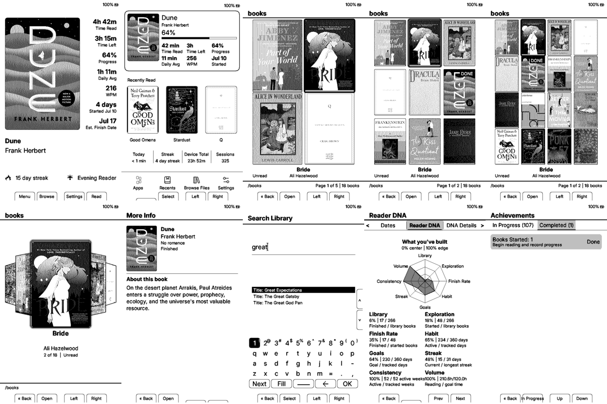
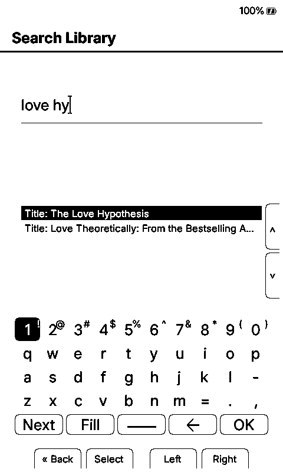
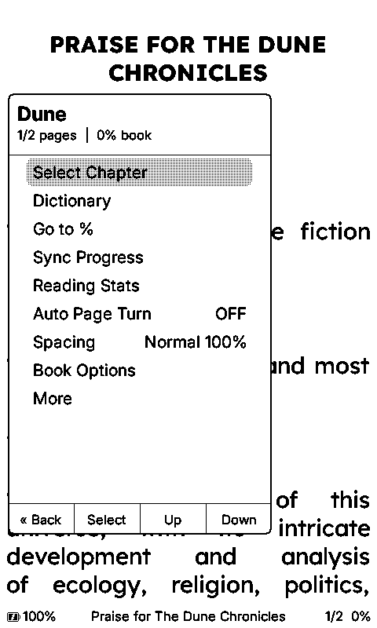
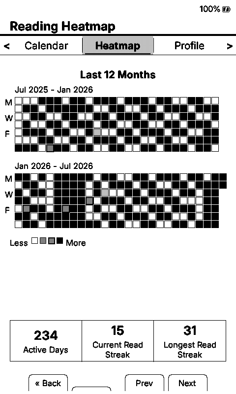
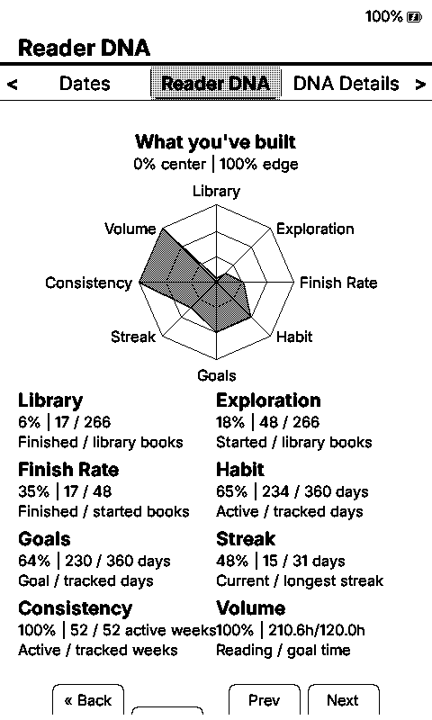
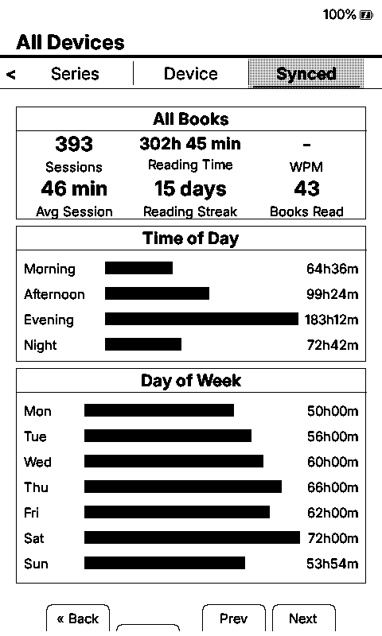
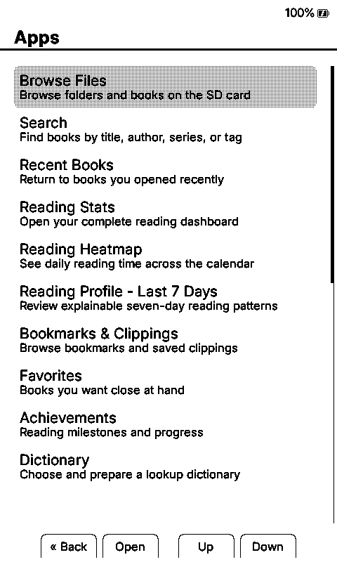
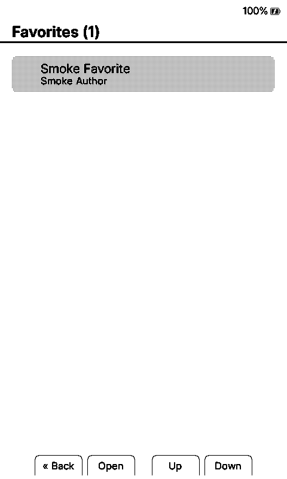
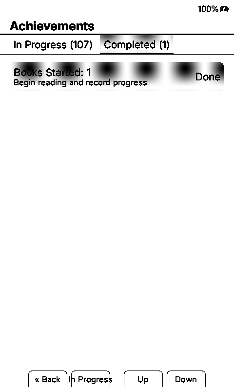

<!-- Official Duet project README. -->

<div align="center">

# Duet

**Open-source firmware for the Xteink X3 and X4: device-to-device sync with no server or account, deep reading analytics, customizable dashboards, a categorized SD-card font system, StarDict dictionaries, 108 achievements, and cover-grid and carousel libraries with smart search.**

</div>

> **Early alpha.** Duet is under active physical-device testing. Back up your device and SD card before flashing, keep a recovery build available, and read [Alpha Testing](docs/ALPHA_TESTING.md) before installing.

**Official repository:** https://github.com/lauren-alexandra/duet-xteink **Creator and sole maintainer:** [Lauren Landau](AUTHORS.md) **License:** [MIT](LICENSE)

Duet is an independent, one-person project. Lauren directs the product, designs the experience, tests both physical devices, maintains the release, and reviews the implementation, with coding assistance from tools including OpenAI's Codex and Anthropic's Claude. Upstream and community work remains credited throughout the project.

This README covers the _whole_ experience — the foundations inherited from the wonderful projects this build stands on, and the work original to this fork — with credit where each piece began. See [Credits & lineage](#credits--lineage).

For the source-verified, item-by-item inventory, including the exact 33 statistics pages, all eight Home themes, all 22 launcher destinations, all 108 achievement milestones, device-specific font sizes, exclusions, and feature lineage, see the [Duet Feature and Lineage Catalog](FEATURES.md).

For the complete public-facing story in one place, including how the features work together, what came from each upstream project, what is original to Duet, and what the alpha still needs to prove, read [Duet: the complete feature tour](docs/DUET_FULL_FEATURE_TOUR.md).

---

## Downloads

The current tester release is **Duet v0.1.0-alpha.9**:

- [Download the X3 firmware BIN](https://github.com/lauren-alexandra/duet-xteink/releases/download/v0.1.0-alpha.9/Duet-X3-v0.1.0-alpha.9.bin)
- [Download the X4 firmware BIN](https://github.com/lauren-alexandra/duet-xteink/releases/download/v0.1.0-alpha.9/Duet-X4-v0.1.0-alpha.9.bin)
- [Download the complete firmware ZIP](https://github.com/lauren-alexandra/duet-xteink/releases/download/v0.1.0-alpha.9/Duet-v0.1.0-alpha.9-firmware.zip)
- [Download the complete 123-family Duet font pack](https://github.com/lauren-alexandra/duet-xteink/releases/download/v0.1.0-alpha.9/Duet-Open-Font-Pack-v1.zip)
- [Download the ready-to-copy WordNet 3.0 dictionary pack](https://github.com/lauren-alexandra/duet-xteink/releases/download/v0.1.0-alpha.9/Duet-WordNet-3.0-StarDict.zip)
- [Download SHA-256 checksums](https://github.com/lauren-alexandra/duet-xteink/releases/download/v0.1.0-alpha.9/SHA256SUMS.txt)
- [Read the alpha.9 release page](https://github.com/lauren-alexandra/duet-xteink/releases/tag/v0.1.0-alpha.9)

The optional Duet Open Font Pack contains 123 ready-to-copy families and all six reader sizes for both devices. If you only want a few fonts, use **Settings > Reader > Font Options > Manage Fonts** for the credited 24-family compatibility catalog or follow the exact upstream source links in the pack's manifest. See [Fonts](docs/sd-card-fonts.md) for installation, previews, selective-source options, and conversion instructions.

## Start here

New to Duet? Begin with the [Start Here guide](docs/START_HERE.md). It puts the instructions in one order instead of making you hunt through the repository:

- **First installation or recovery:** choose the correct model under [Downloads](#downloads), then follow [Installation](docs/installation.md).
- **Updating an existing Duet reader:** the [SD-card update route](docs/START_HERE.md#updating-an-existing-duet-installation).
- **Loading books, fonts, dictionaries, and library metadata:** [library setup](docs/START_HERE.md#loading-books-and-building-the-library), [Dictionary Setup](docs/DICTIONARY_SETUP.md), and the full [User Guide](USER_GUIDE.md).
- **Preparing EPUB metadata and a large cover library:** run [EPUB WPM Preparation](docs/EPUB_LOCATION_ENRICHMENT.md) before [Desktop Cover Prefill](docs/COVER_PREFILL.md), or give a local computer assistant the combined [AI Library Prep Prompt](docs/AI_LIBRARY_PREP_PROMPT.md).
- **Syncing an X3 and X4:** [Nearby Position Sync](docs/nearby-position-sync.md) and [Nearby Reading Stats Sync](docs/reading-stats-sync.md).
- **Testing and reporting:** [Alpha Testing](docs/ALPHA_TESTING.md), the ordered [Alpha.9 Acceptance Quickstart](docs/ALPHA9_ACCEPTANCE_QUICKSTART.md), and the repository's report forms.
- **Fixing a failed update, damaged card, or missing covers:** [Troubleshooting](docs/troubleshooting.md).

---

## Alpha status

Duet v0.1.0-alpha.9 targets both X3 and X4, including newer display and power-latch hardware detected by the current FreeInk SDK. The public alpha is intended to find device-specific and large-library behavior that two personal devices cannot reproduce alone. The current test targets include hardware-variant detection, statistics responsiveness and WPM estimates, first-use cover hydration, picker responsiveness while covers load, carousel thumbnail quality, guarded chapter pre-indexing, X3/X4 performance differences, font-download back-out, and repeated two-device sync.

See [Duet Alpha Testing](docs/ALPHA_TESTING.md) for the current known issues, test matrix, privacy rules, and useful logs. A successful build or simulator run is not presented as physical-device acceptance. Use the repository's **Alpha Test Report** form for successful or mixed sessions and **Alpha Bug Report** for one reproducible defect. Maintainer-side publication follows the [release runbook](docs/MAINTAINER_RELEASE_RUNBOOK.md); incoming reports follow the [alpha triage guide](docs/ISSUE_TRIAGE.md).

All thoughtful feedback is welcome, including bugs, rough or confusing interactions, feature ideas, accessibility needs, documentation corrections, performance observations, and reports that something worked especially well. Open-ended feedback belongs in GitHub Discussions; reproducible defects and structured test results belong in the matching report form.

Developers are especially welcome. Duet is currently maintained by Lauren alone, but it is not intended to be developed behind a velvet rope: focused pull requests, debugging help, performance investigations, X3/X4 hardware expertise, documentation, build tooling, accessibility work, and release QA would all be genuinely appreciated. Start with [Contributing to Duet](CONTRIBUTING.md), and open a Discussion before investing heavily in a large feature or architectural change.

## Screenshots and demos

Duet uses the same interface and feature code on X3 and X4, so the gallery shows each shared screen once at representative X4 resolution instead of duplicating every image. These simulator captures use recognizable books from Lauren's library as interface examples. Every reading-history value, date, progress value, achievement state, device name, and sync value is fabricated. No EPUBs, extracted cover files, personal catalogs, or real device-state files are included.

[](docs/media/alpha-0.1.0/x4/feature-overview.png)

| Dashboard | Cover grid | Carousel |
| --- | --- | --- |
| [](docs/media/alpha-0.1.0/x4/dashboard.png) | [](docs/media/alpha-0.1.0/x4/grid-3x3.png) | [](docs/media/alpha-0.1.0/x4/carousel.png) |

| Search autocomplete | More Info | Reader quick menu |
| --- | --- | --- |
| [](docs/media/alpha-0.1.0/x4/search-autocomplete.png) | [](docs/media/alpha-0.1.0/x4/more-info.png) | [](docs/media/alpha-0.1.0/x4/reader-quick-menu.png) |

| Reading heatmap | Reader DNA | All-device stats |
| --- | --- | --- |
| [](docs/media/alpha-0.1.0/stats/x4/smoke-stats-heatmap.png) | [](docs/media/alpha-0.1.0/stats/x4/smoke-stats-reader-dna.png) | [](docs/media/alpha-0.1.0/stats/x4/smoke-stats-all-devices.png) |

| Apps | Favorites | Achievements |
| --- | --- | --- |
| [](docs/media/alpha-0.1.0/x4/apps.png) | [](docs/media/alpha-0.1.0/x4/favorites.png) | [](docs/media/alpha-0.1.0/x4/achievements.png) |

Browse the [complete 69-image media gallery](docs/media/alpha-0.1.0/README.md), including every current Reading Stats page and detail state once for the shared X3/X4 interface.

---

## Reading, first and always

The core reader — inherited from [CrossPoint Reader](https://github.com/crosspoint-reader/crosspoint-reader) via [CrossInk](https://github.com/uxjulia/CrossInk) and polished throughout this fork:

- **EPUB, XTC/XTCH, TXT, and Markdown**, with hyphenation for ten languages and a translated UI.
- A **quick overlay menu** in every book: Chapter picker, Dictionary, Go To %, Sync (with a KOReader-or-Nearby chooser), Reading Stats, Tilt page-turn (on devices with an accelerometer), Auto Page Turn, line spacing, and Reader Options — plus a full menu with bookmarks, clippings, screenshots, QR sharing, and Book Info.
- **Refresh modes** (Auto / Fast / Half / Full), **Text Darkness** (Normal / Dark / Extra Dark), **Bionic Reading** (Off / Normal / Subtle), Dark Reader Mode, orientation control, and status-bar customization.
- **Guarded chapter pre-indexing**: the next chapter can build silently in the background while you read, cooperatively yielding and cancelling at safe checkpoints when input arrives. Timing logs expose completion, cancellation, low-memory deferral, and failure.
- Compatible six-size SD-card families provide **10 / 12 / 14 / 16 / 18 / 20 pt on both X3 and X4**, with real layout reflow at every installed size. The smaller device-specific sets embedded in the BIN are emergency fallbacks, not the normal Duet font experience.
- Per-book progress survives updates and restarts, and **Quick Resume** can preserve the visible page while sleeping.
- Reading position, bookmarks, clippings, and stats are debounce-persisted; active reading time is committed before deep sleep through an idempotent path.

## Nearby Sync — two readers, one reading life

Own two devices? They talk **directly to each other** over ESP-NOW radio. No WiFi network. No cloud. No account. Both on the sync screen, one press, seconds.

- **Nearby Stats Sync** exchanges complete reading histories: global totals, per-book time/sessions/pace/dates/status, the daily journal, the per-day book-attribution ledger, the readers' Stats Date, and persistent achievement milestones. Its merge records are designed to be idempotent; repeated two-device convergence remains an explicit alpha test target.
- **Nearby Position Sync** (inherited from CrossInk) shows both devices' positions in the current book side by side and moves you only when you explicitly apply.
- After a successful merge, stats are intended to become **person-level**: streaks, calendars, heatmaps, day counts, and averages should agree on both devices.
- Library indexes are cached per device and rebuilt when the library changes; later sync preparation reuses that cache.

## The Reading Statistics Lab

Exactly **33 top-level pages** for people who want to _see_ their reading. Aggregate views are merge-aware where applicable; device-local and all-device totals remain explicitly distinguishable. The [canonical catalog](FEATURES.md#the-33-top-level-pages) names every page and the data it shows.

- **Reader DNA** — a six-axis hexagonal radar (Habit, Volume, Focus, Pace, Streak, Finisher) with an overall score, descended from CPR-vCodex's reading-profile diamond and expanded here.
- **Reading Dates** — scrollable start and finish history with a guarded per-book date editor.
- **Reading Signature** — a plain-language reading-style summary with a separate raw-metrics page.
- **Reading Wrapped** — the 12-month card: time, days read, books finished, longest streak, best weekday, average session.
- **Charts everywhere**: weekday fingerprint · 30-day pace trend with a _Speeding up / Slowing down / Steady_ verdict · time-of-day bars · 12-month bars · cumulative year line with a pages-turned odometer · session-length mix · streak milestone ladder (3-7-14-30-60-100) · started-vs-finished monthly pairs · fastest-reads ranking · per-device comparison.
- **True WPM when the current book supports it**: visible words-per-minute and reference-page statistics use `META-INF/x-locations.json` inside the EPUB. Plain EPUBs still read normally; run [EPUB WPM Preparation](docs/EPUB_LOCATION_ENRICHMENT.md) once after adding new books. Pace, DNA, and Signature pages can attribute qualifying ledger entries for that enriched current book without reopening EPUBs while drawing; unknown historical books are omitted instead of estimated from screen pages.
- **The daily record**: 14-day activity chart, 12-month heatmap, monthly calendar with per-day book drill-down and safe per-book time corrections, 90-day exact daily minutes, trends, goals and goal streaks, recent sessions, and Started Books with estimated finish dates.
- **Full session logging**: every session's exact start time, duration, pages, and book — the foundation for future hour-by-hour reading-rhythm analytics.
- **Designed for repairability**: journal, ledger, session log, and per-book records live in separate CRC-checked files so one damaged record does not erase the rest of the history. Books under `/ignore_stats/` keep progress without polluting statistics.
- **Complete stats archives**: validated `.cstats` exports include global, session, date, sync, library, per-book, and achievement state from Duet's canonical `/.duet` namespace. Restore validates structure and per-entry CRCs, accepts mapped legacy `/.crossink` and `/.crosspoint` records, preserves achievements when importing older archives that predate them, and creates an automatic safety copy first. Non-empty content-level round trips pass both device simulators; physical X3/X4 verification remains an alpha acceptance item.
- Clockless devices keep an editable, CRC-protected **Stats Date**, so daily history works without an RTC chip.

## Home, your way

- **Eight home themes** — from Minimal (a cover and a quote) through classic lists to the full Dashboard and the CrossPet-derived **Dashboard Extended** with current-book card, chapter context, recent covers, and a stats strip.
- **The Home Stats picker** (Settings → Display → Home Stats): every stat slot on every stat-bearing theme is your choice from the full catalog — including _This Device_ vs _All Devices_ totals. Seven dashboard rows, two footer slots, four strip tiles.
- **Launcher customization**: assign, hide, and reorder every Home and Apps shortcut on-device — with guaranteed escape routes so customization can never strand you.
- Configurable **Power-button multi-click actions** while awake (single / double / triple), long-press actions, and a Sleep shortcut.

## The library

- **Cover grids** (2×2, 3×3, 4×4 with author lines — geometry lineage from CrumBLE) and a **five-cover carousel** built on CrossInk Carousel's engine, both with exact-size pre-cached thumbnails and reading-status badges.
- **Smart search** with ranked title/author/series autocomplete that never opens an EPUB just to make a suggestion; short press opens the book, long press opens More Info.
- **More Info**: cover, author, series, genre, reading status, progress, an optional spice/heat tag, and a catalog-backed summary — powered by an optional Calibre-exported catalog. Spice metadata is opt-in: libraries that do not use it simply do not show or count it.
- **All / In Progress / Unread / Finished** filters with cover badges, Library Overview, Reading Taste, and Series Progress pages.
- Favorites with reorder and automatic path repair; Recent Books that never parses an EPUB during navigation; folder levels stay in a fast, familiar list.
- **Input-first shelves**: placeholders paint before cover work, and hydration is structured to yield at safe checkpoints for navigation. Consistent responsiveness under large-library load remains an alpha test target.
- **Clean Library Cache** compares the books actually present on the card with their cache folders, moves confirmed orphans into a recoverable `/.duet/books/.attic`, works in bounded batches, and refuses to clean when the library scan is incomplete.
- For large or multiply organized libraries, the optional [desktop cover prefill](docs/COVER_PREFILL.md) generates all exact X3/X4 grid and carousel thumbnails in one computer-side pass. The firmware still handles genuinely new books later.

## Dictionaries

- **StarDict format** (`.ifo` / `.idx` / `.dict` / optional `.syn`) under `/dictionaries/<Name>/` — multi-dictionary, with in-book word selection, suggestions, definitions, and per-book looked-up-words history (engine lineage: CPR-vCodex, hardened with CrumBLE's SEEK-derived recovery patterns).
- Corrupt-cache recovery, watchdog-safe yielding index scans, visible build progress, and low-memory preflight.
- The current release includes a separate, ready-to-copy WordNet 3.0 StarDict ZIP with its original license. Follow [Dictionary Setup](docs/DICTIONARY_SETUP.md) to install it, prepare the index, look up a word, or troubleshoot a third-party package.

## Fonts

- A categorized `.cpfont` system organized by Serif, Sans Serif, Mono/Typewriter, Accessibility, Handwritten/Script, and Blackletter/Decorative. A family exposes the sizes and up to four real styles actually installed; the SD-card generator supports six sizes from 10–20 pt.
- **A/B comparison view** at matched sizes, compact Normal/Italic/Bold specimens, real face detection, and synthetic bold/italic fallbacks when a family lacks those files.
- A cached font catalog avoids rescanning every installed family on each boot. On the maintainer's development cards this reduced discovery to a small fraction of the prior path; exact timing varies with card and font set.

The Alpha.9 release also offers an optional 123-family Duet Open Font Pack with 738 validated `.cpfont` files covering 10, 12, 14, 16, 18, and 20 pt. People who want only selected families can use the smaller on-device catalog or follow the upstream projects recorded in the pack's source manifest. See [Fonts](docs/sd-card-fonts.md) for installation and [FONT_SOURCES.md](FONT_SOURCES.md) for the source and redistribution ledger.

## Apps

**Achievements** (108 — 62 CPR-vCodex thresholds plus 46 Duet milestones; retroactively adopted, restart-persistent, and included in protocol v6 Nearby Stats Sync and `.cstats`) · **Favorites** · **Tetris** (adapted from Biscuit) · **If Found** contact card · **Screen Clean** deep-refresh cycles · on-device **Read Me** guide · **File Transfer** web portal · **OPDS** browsing/downloading · **KOReader Sync** setup · the Nearby sync screens. The exact launcher catalog is in [FEATURES.md](FEATURES.md#home-themes-and-launcher).

## Sleep

- Twelve sleep modes: Blank, Dark, Light, Custom, Cover, Cover + Custom, Page Overlay, Reading Stats, Minimal, Minimal Stats, Dashboard, and Quick Resume. Minimal Stats is currently available on X3 and hidden on X4.
- Custom BMP rotation plus BMP or transparency-aware PNG artwork in **Page Overlay** mode; Fit/Crop and cover filters apply where relevant.
- Optional locked-device Power-click cycling to summon a fresh sleep image and return directly to sleep. CrumBLE introduced the original one-tap behavior; Duet expands it to Off / 1 / 2 / 3 clicks and defaults to 3 to reduce accidental changes. See the [feature tour](docs/DUET_FULL_FEATURE_TOUR.md#locked-sleep-image-cycling) for the feature and [Controls](docs/controls.md#locked-sleep-image-cycling) for the current physical-device gesture note.
- Reading time is committed before deep sleep, idempotently — repeated sleep/wake can neither lose nor double-count a minute.

## Performance engineering

Speed is treated as a feature, and every cut is measured first:

- Hot system files were relocated out of the crowded per-book cache directory after on-device telemetry showed multi-second FAT directory scans on the maintainer's large cards. One migration removes that repeated scan from multiple common paths; exact boot and navigation timing remains card-, library-, and device-dependent.
- On-card **breadcrumb telemetry** (boot phases, sync preparation, picker timings, reader transitions) so regressions are diagnosed from data, not vibes.
- Crash reports capture the exact faulting program counter for one-line diagnoses.
- Debounced persistence, bounded caches sized for the X3's ~380 KB heap, no-throw allocation discipline, and a simulator smoke suite that walks the whole UI before anything touches hardware.

## Install firmware

Public alpha downloads will be published only through this repository's [Releases](https://github.com/lauren-alexandra/duet-xteink/releases) page.

Read the [Start Here guide](docs/START_HERE.md) and [full installation instructions](docs/installation.md) before flashing. The short version is:

1. **Back up your SD card.**
2. Download the correct BIN for your device (`Duet-X3-v0.1.0-alpha.9.bin` or `Duet-X4-v0.1.0-alpha.9.bin`).
3. For a first Duet installation or recovery, use the CrossPoint web installer's **Custom .bin** option.
4. For a Duet-to-Duet update, put exactly one firmware BIN at the SD-card root, then choose **Settings → System → SD Firmware Update**.
5. After flashing, confirm **Settings → System** shows the expected Duet version before a long reading session.
6. Optional extras: fonts under `/fonts`, dictionaries under `/dictionaries/<Name>/`, a Calibre catalog for library metadata, sleep images, and an `if_found.txt`.

Both devices must run the same release to sync with each other.

## Building

PlatformIO. Public device targets ship all ten hyphenation languages and neutral version strings:

```
pio run -e x3-public
pio run -e x4-public
```

`pio run -e simulator` builds the desktop simulator used by the smoke suite.

## Credits & lineage

This firmware exists because a chain of generous projects shared their work. Direct code adaptation and design lineage are both credited; full details with audited revisions live in `THIRD_PARTY_NOTICES.md`.

- **[CrossPoint Reader](https://github.com/crosspoint-reader/crosspoint-reader)** — the original firmware everything here descends from.
- **[CrossInk](https://github.com/uxjulia/CrossInk)** by uxjulia — the upstream base of this fork: the reader core, web portal, OPDS, sleep system, SD fonts, Nearby Position Sync, and more.
- **[CrossInk Carousel](https://github.com/chintanvajariya/CrossInk-Carousel)** by chintanvajariya — the home carousel engine reused for this fork's library carousel; cover-first navigation inspired by [CrossPoint Flow](https://github.com/ideo2004-afk/crosspoint-reader-lua).
- **[CrumBLE](https://github.com/imshentastic/CrumBLE)** by imshentastic — bookshelf grid geometry, dictionary hardening patterns (transitively from [SEEK Reader](https://github.com/seek-reader/seek)), locked Power-click sleep cycling, and deep-sleep time-commit behavior (transitively from [aalu's CrossPoint fork](https://github.com/aaludon/crosspoint-reader-aalu)). Also the exemplar this README's structure is modeled on.
- **[CPR-vCodex](https://github.com/franssjz/cpr-vcodex)** by franssjz — the StarDict dictionary engine and UI, the first 62 achievement milestones, and the reading-identity philosophy (and original radar) behind this fork's statistics lab.
- **[CrossPet](https://github.com/trilwu/crosspet)** by trilwu — the Dashboard Extended layout lineage and the awake multi-click Power detector.
- **[Biscuit](https://github.com/yattsu/biscuit)** by yattsu — the Tetris implementation this fork's version is adapted from.
- **Font projects** — every redistributed family is openly licensed (OFL and similar), with sources, revisions, and per-family licenses recorded in `FONT_SOURCES.md`.

Original to this fork: the current Nearby reading-statistics merge protocol and attribution ledger, the statistics lab and its chart pages, the Home Stats picker, session logging, the hot-file relocation and the rest of the performance program, 46 achievements, and the two-device reliability work throughout.

See [Features Unique To Duet](FEATURES.md#features-unique-to-duet) for the comprehensive list and the boundary between original Duet behavior and credited upstream foundations.

## License

Duet is released under the [MIT License](LICENSE). Copyright in Duet's original modifications and additions is held by Lauren Landau; upstream and third-party copyrights remain with their respective authors.

See [AUTHORS.md](AUTHORS.md), [THIRD_PARTY_NOTICES.md](THIRD_PARTY_NOTICES.md), and [PROJECT_IDENTITY.md](PROJECT_IDENTITY.md).
