# Duet Alpha.6 Screenshot Gallery

These screenshots were generated at native X3 and X4 resolution from the Duet v0.1.0-alpha.6 simulator path. The gallery uses recognizable books from Lauren's library so the interface looks like a real, varied reader. Every reading statistic, progress value, date, achievement state, device name, and sync value is deterministic fabricated test data. No EPUB, extracted cover asset, personal catalog, credential, contact detail, or real device-state file is included.

## Feature Overviews

| X4 | X3 |
| --- | --- |
|  |  |

## Home And Navigation

| X3 Dashboard | X3 Reading Home | X3 Home Menu |
| --- | --- | --- |
|  | [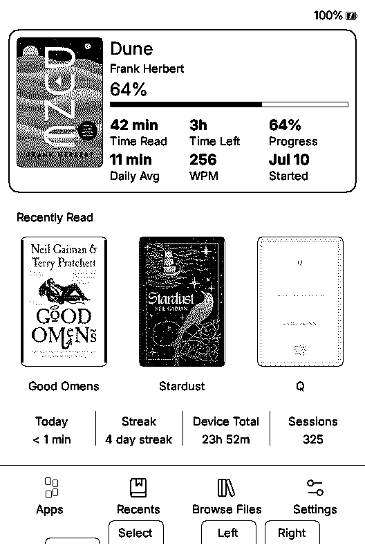](x3/reading-home.png) | [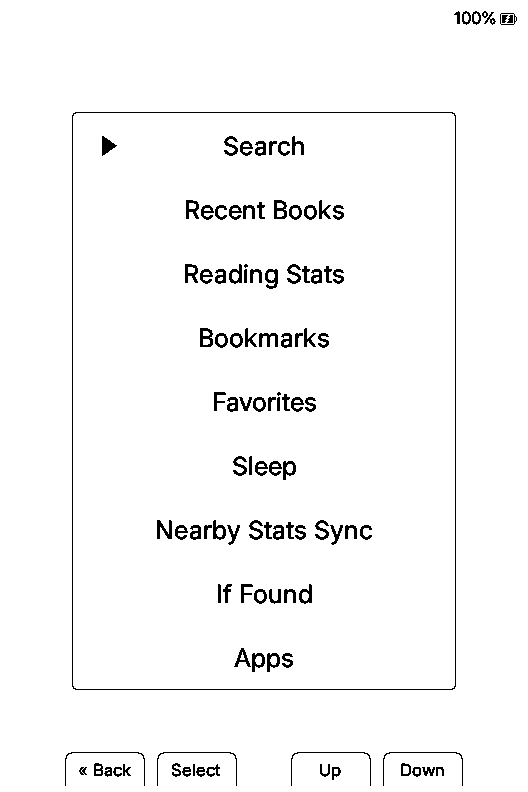](x3/home-menu.png) |

| X4 Dashboard | X4 Reading Home | X4 Home Menu |
| --- | --- | --- |
|  |  |  |

## Cover Libraries

| X3 2x2 Grid | X3 3x3 Grid | X3 4x4 Grid |
| --- | --- | --- |
|  |  |  |

| X4 2x2 Grid | X4 3x3 Grid | X4 4x4 Grid |
| --- | --- | --- |
|  |  |  |

| X3 Carousel | X3 Scrolling Title | X4 Carousel | X4 Scrolling Title |
| --- | --- | --- | --- |
|  |  |  |  |

## Search And Book Information

| X3 Autocomplete | X3 Filled Suggestion | X3 Results | X3 More Info |
| --- | --- | --- | --- |
|  | [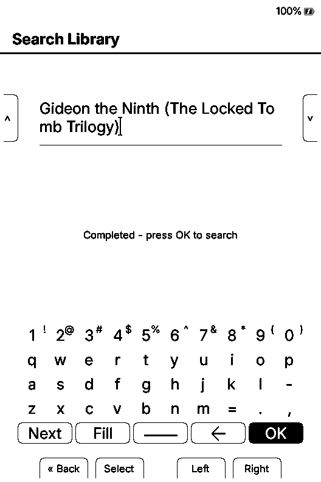](x3/search-autocomplete-filled.png) | [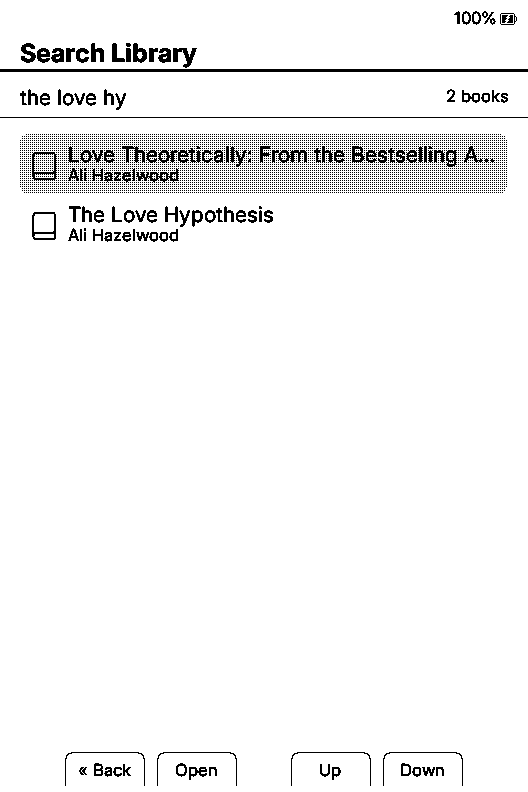](x3/search-results.png) | [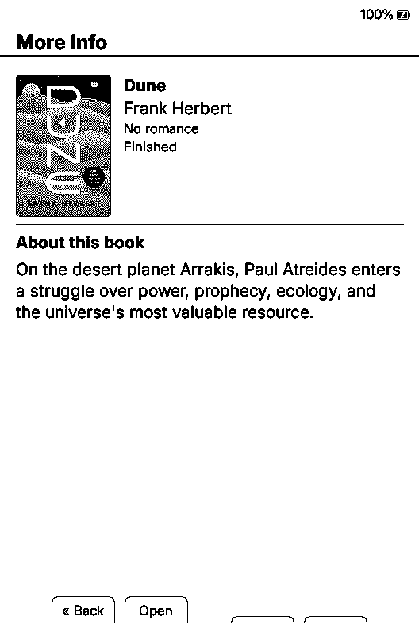](x3/more-info.png) |

| X4 Autocomplete | X4 Filled Suggestion | X4 Results | X4 More Info |
| --- | --- | --- | --- |
|  |  |  |  |

## Reading Tools And Apps

| X3 Reader Menu | X3 Book Info | X4 Reader Menu | X4 Book Info |
| --- | --- | --- | --- |
| [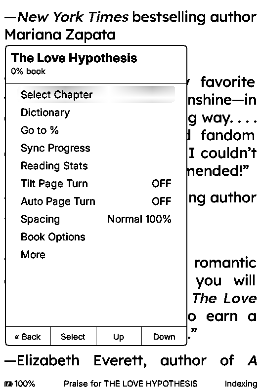](x3/reader-quick-menu.png) | [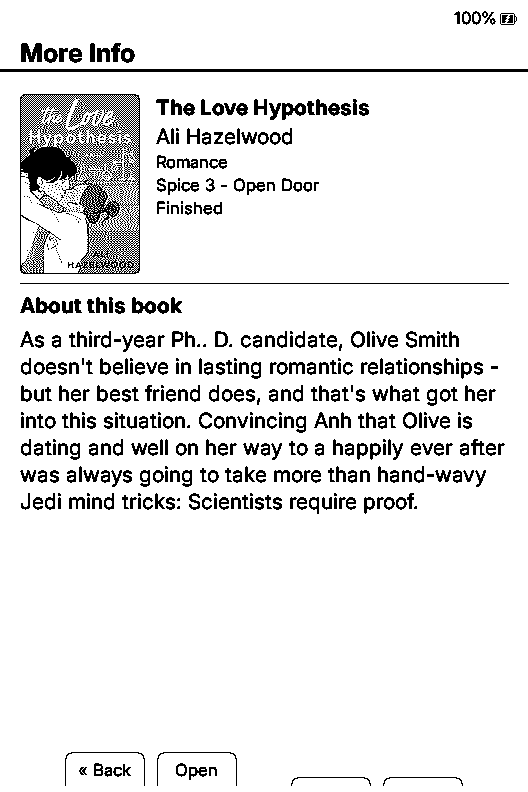](x3/reader-book-info.png) |  |  |

| X3 Dictionary List | X3 Definition | X4 Dictionary List | X4 Definition |
| --- | --- | --- | --- |
| [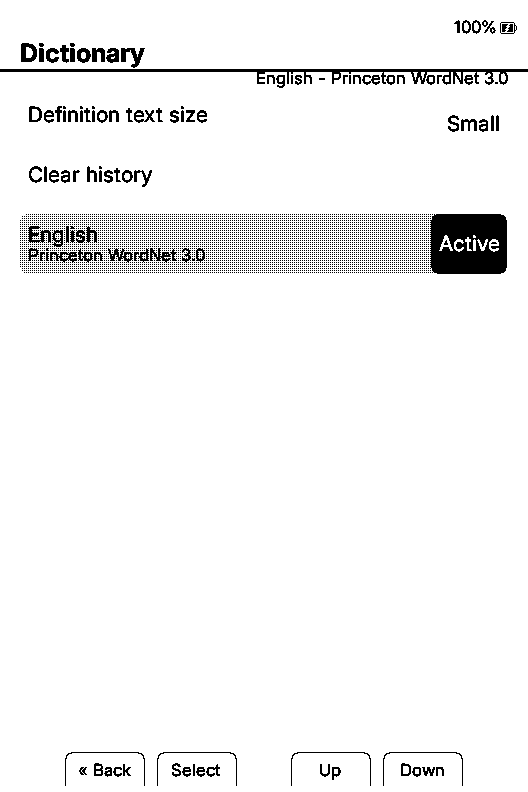](x3/dictionary-list.png) | [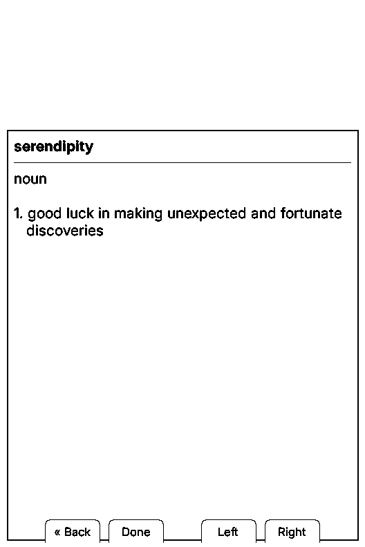](x3/dictionary-definition.png) |  |  |

| X3 Apps | X3 Favorites | X4 Apps | X4 Favorites |
| --- | --- | --- | --- |
| [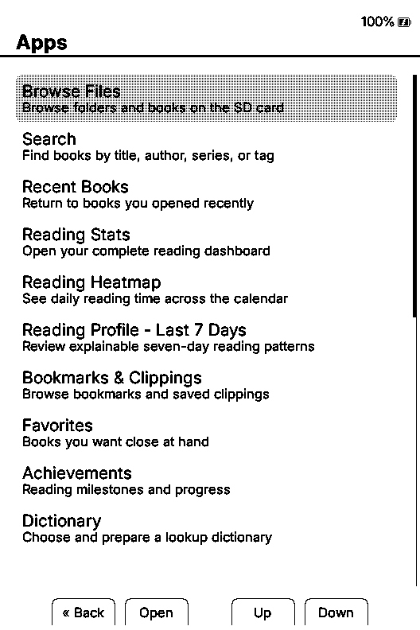](x3/apps.png) | [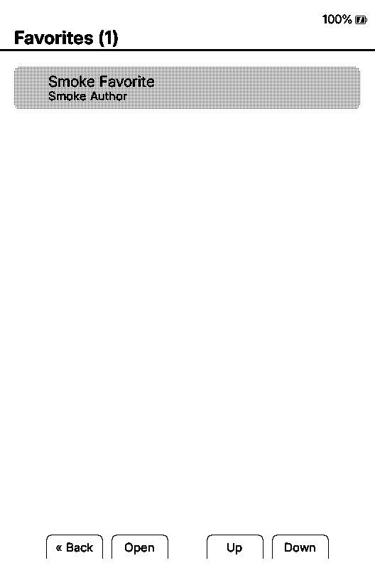](x3/favorites.png) |  |  |

| X3 Achievements | X3 Completed | X4 Achievements | X4 Completed |
| --- | --- | --- | --- |
| [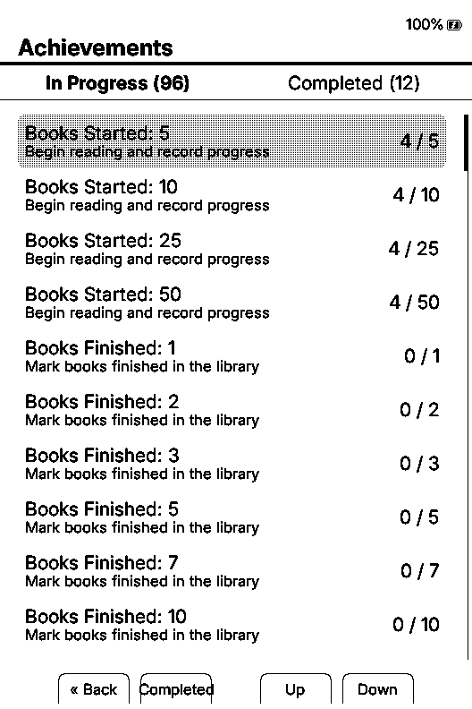](x3/achievements.png) | [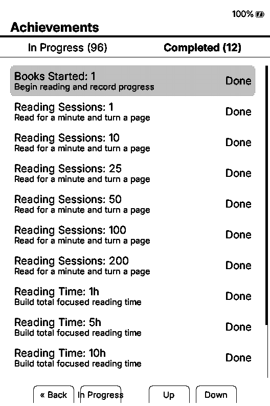](x3/achievements-completed.png) |  |  |

| X3 Tetris | X4 Tetris |
| --- | --- |
| [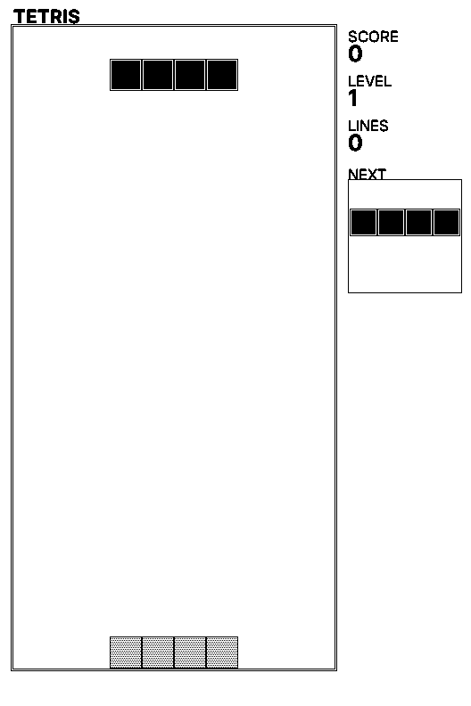](x3/tetris.png) |  |

## Font Variety

Each picker capture compares a different current family with a different preview family, so the four examples showcase eight fonts rather than repeating the preview as the current selection.

| NV Newsreader / Bookerly | NV Garamond / NV Bitter | Atkinson Hyperlegible Next / OpenDyslexic | Cormorant Garamond / Great Vibes |
| --- | --- | --- | --- |
|  |  |  |  |

## Complete Reading Stats Gallery

The [complete X3/X4 Reading Stats gallery](stats/README.md) contains all 33 top-level pages and 10 alternate or detail states for each device, for 86 native-resolution images.

| Reading Heatmap | Reader DNA | All-Device Stats |
| --- | --- | --- |
|  |  |  |

## Evidence Boundary

Simulator screenshots prove rendering and deterministic UI coverage. They do not prove physical-device timing, SD-card behavior, panel refresh quality, sleep/wake behavior, radio sync, or long-session stability. Those remain part of the [physical test matrix](../../PHYSICAL_TEST_MATRIX.md) and alpha tester program.

## Still To Capture On Physical Devices

The gallery is intentionally honest about what the simulator cannot prove. The remaining public media set needs:

- Nearby Position Sync and Nearby Reading Stats Sync on two readers.
- KOReader Sync without account details.
- Clean X3 and X4 boot and sleep frames.
- The System page showing the exact public Duet version.
- The file-transfer web portal after an alpha.6 comparison and privacy pass.
- An X3 and X4 together photo.
- Short unsped clips of grid navigation, carousel hydration, book open/close, chapter pre-indexing, and two-device sync.
