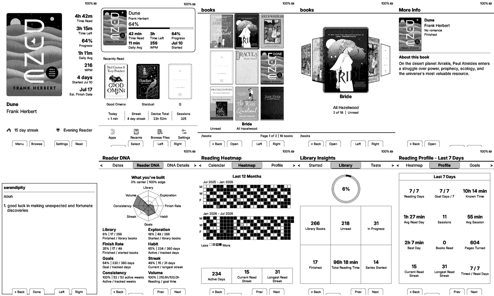
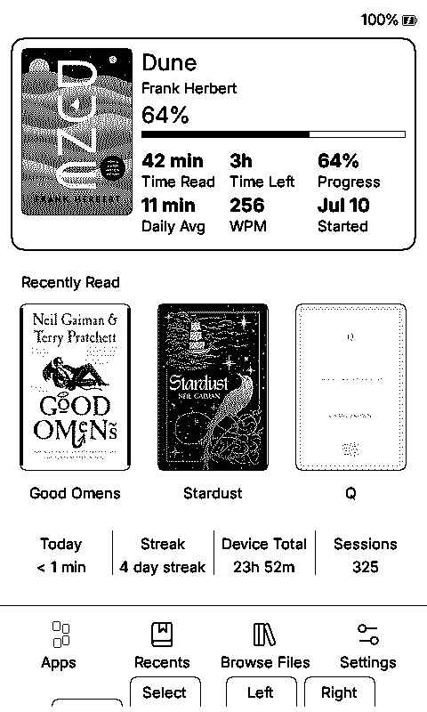
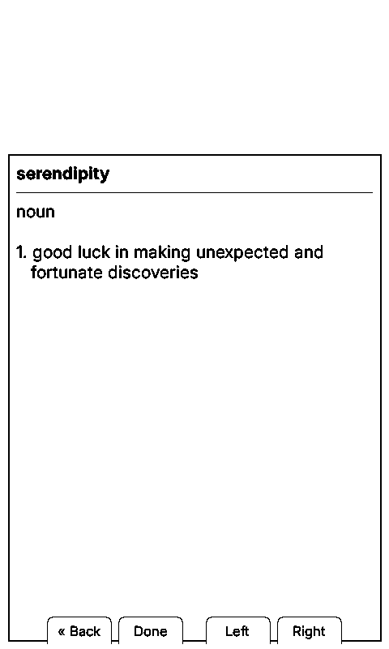
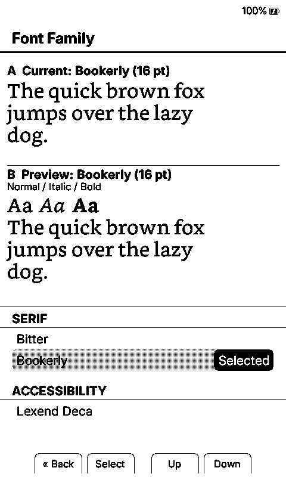

# Duet Alpha.6 Screenshot Gallery

These screenshots were generated at native X3 and X4 resolution from the Duet v0.1.0-alpha.6 simulator path. The main gallery mixes recognizable books from Lauren's library with public-domain classics so the interface looks like a real, varied reader. Every reading statistic, progress value, date, achievement state, device name, and sync value is deterministic fabricated test data. No EPUB, extracted cover asset, personal catalog, credential, contact detail, or real device-state file is included.

## Feature Overviews

| X4 | X3 |
| --- | --- |
|  |  |

## Home And Library

| X4 Dashboard | X4 Reading Home | X4 3x3 Grid |
| --- | --- | --- |
|  |  |  |

| X4 Carousel | X4 More Info | X4 Search |
| --- | --- | --- |
|  |  |  |

The full X4 density set is available as [2x2](x4/grid-2x2.png), [3x3](x4/grid-3x3.png), and [4x4](x4/grid-4x4.png). Matching X3 captures include [Dashboard](x3/dashboard.png), [Reading Home](x3/reading-home.png), [3x3 Grid](x3/grid-3x3.png), [Carousel](x3/carousel.png), and [More Info](x3/more-info.png).

## Reading Tools And Apps

| Reader quick menu | Dictionary | Achievements |
| --- | --- | --- |
|  |  |  |

Additional captures show [Book Info from the reader](x4/reader-book-info.png) and [Tetris](x4/tetris.png).

## Font Variety

| Bookerly | NV Bitter | OpenDyslexic | Great Vibes |
| --- | --- | --- | --- |
|  |  |  |  |

## Complete Reading Stats Gallery

The [complete X3/X4 Reading Stats gallery](stats/README.md) contains all 33 top-level pages and 10 alternate or detail states for each device, for 86 native-resolution images.

## Reproducible Classics Demo

The separate [X3](demo/x3/) and [X4](demo/x4/) demo folders use only public-domain classics and the checked-in [`public-classics-library-catalog.tsv`](../../../scripts/fixtures/public-classics-library-catalog.tsv) fixture. They provide neutral, reproducible references for the cover grid, carousel, Reading Home, More Info, and autocomplete search without requiring Lauren's library. The underlying Project Gutenberg EPUBs and extracted cover files are not part of the repository.

## Evidence Boundary

Simulator screenshots prove rendering and deterministic UI coverage. They do not prove physical-device timing, SD-card behavior, panel refresh quality, sleep/wake behavior, radio sync, or long-session stability. Those remain part of the [physical test matrix](../../PHYSICAL_TEST_MATRIX.md) and alpha tester program.
