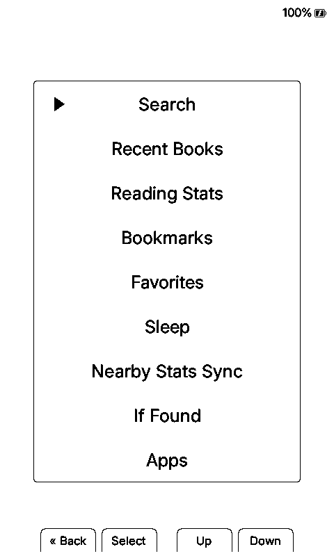
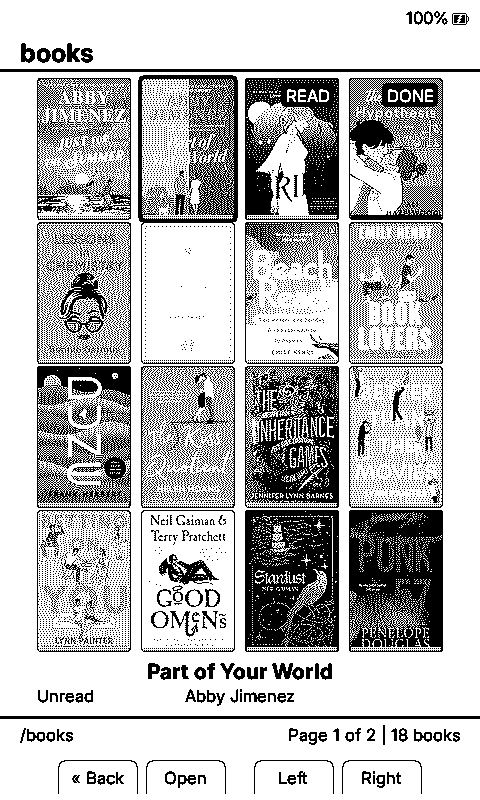
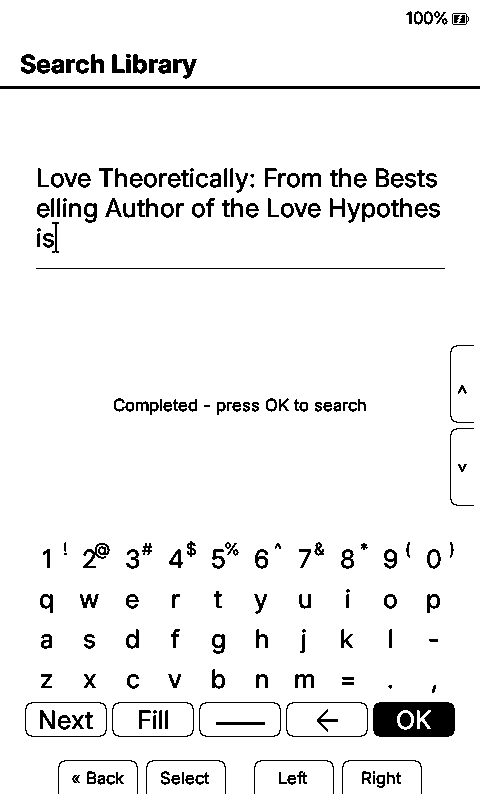
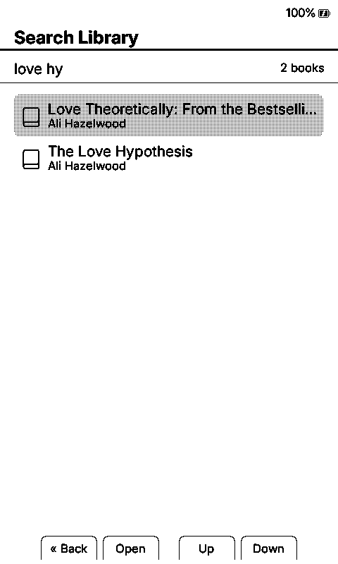
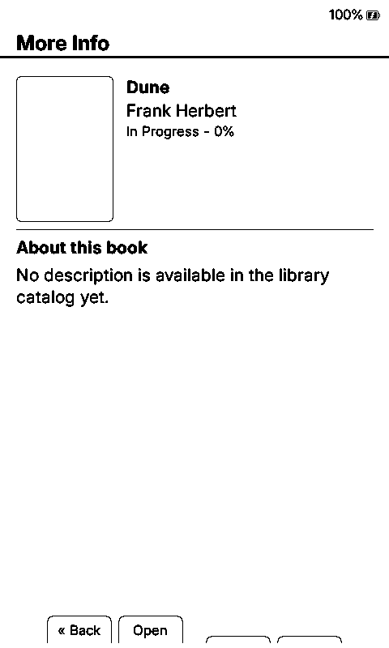
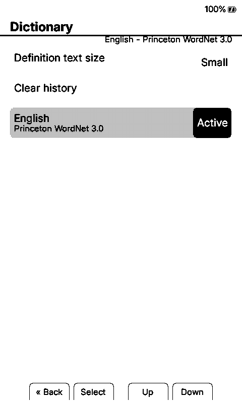
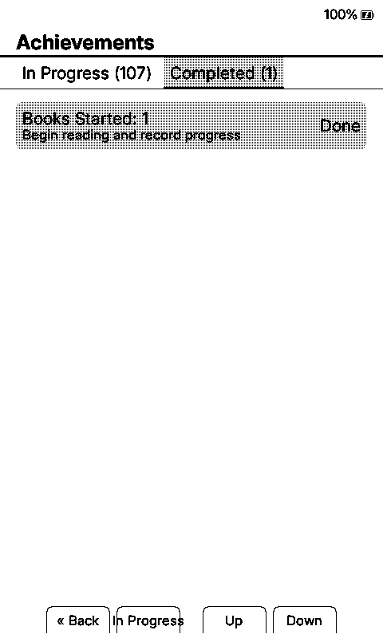
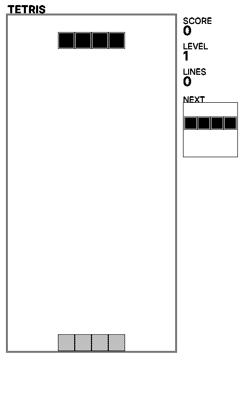

# Duet Alpha Screenshot Gallery

Duet uses the same interface and feature code on X3 and X4, so this gallery shows one representative X4 capture for each shared screen instead of publishing duplicate device sets. The gallery uses recognizable books from Lauren's library so the interface looks like a real, varied reader. Every reading statistic, progress value, date, achievement state, device name, and sync value is deterministic fabricated test data. No EPUB, extracted cover asset, personal catalog, credential, contact detail, or real device-state file is included.

## Feature Overview

## Home And Navigation

| Dashboard | Reading Home | Home Menu |
| --- | --- | --- |
|  |  |  |

## Cover Libraries

| 2x2 Grid | 3x3 Grid | 4x4 Grid |
| --- | --- | --- |
|  |  |  |

| Carousel | Scrolling Title |
| --- | --- |
|  |  |

## Search And Book Information

| Autocomplete | Filled Suggestion | Results | More Info For The Selected Result |
| --- | --- | --- | --- |
|  |  |  |  |

## Reading Tools And Apps

| Reader Menu | Book Info |
| --- | --- |
|  |  |

| Dictionary List | Definition |
| --- | --- |
|  |  |

| Apps | Favorites |
| --- | --- |
|  |  |

| Achievements | Completed Achievements | Tetris |
| --- | --- | --- |
|  |  |  |

## Font Variety

Each picker capture compares a different current family with a different preview family, so the four examples showcase eight fonts rather than repeating the preview as the current selection.

| NV Newsreader / Bookerly | NV Garamond / NV Bitter | Atkinson Hyperlegible Next / OpenDyslexic | Cormorant Garamond / Great Vibes |
| --- | --- | --- | --- |
|  |  |  |  |

## Complete Shared Reading Stats Gallery

The [complete Reading Stats gallery](stats/README.md) contains all 33 top-level pages and 10 alternate or detail states once. The same pages and controls are available on X3 and X4.

| Reading Heatmap | Reader DNA | All-Device Stats |
| --- | --- | --- |
|  |  |  |

## Evidence Boundary

Simulator screenshots prove rendering and deterministic UI coverage. They do not prove physical-device timing, SD-card behavior, panel refresh quality, sleep/wake behavior, radio sync, or long-session stability. Those remain part of the [physical test matrix](../../PHYSICAL_TEST_MATRIX.md) and alpha tester program.

## Still To Capture On Physical Devices

The gallery is intentionally honest about what the simulator cannot prove. The remaining public media set needs:

- Nearby Position Sync and Nearby Reading Stats Sync on two readers.
- KOReader Sync without account details.
- Clean X3 and X4 boot and sleep frames.
- The System page showing the exact public Duet version.
- The file-transfer web portal after an alpha.7 comparison and privacy pass.
- An X3 and X4 together photo.
- Short unsped clips of grid navigation, carousel hydration, book open/close, chapter pre-indexing, and two-device sync.
