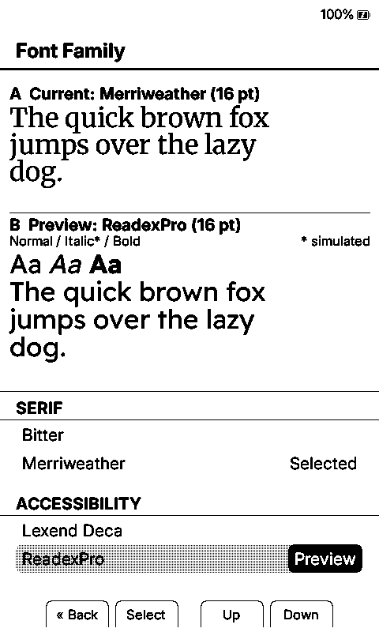
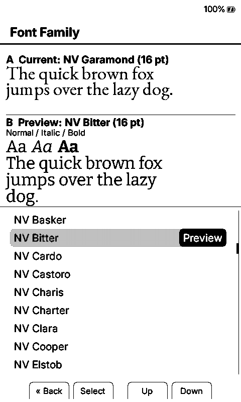
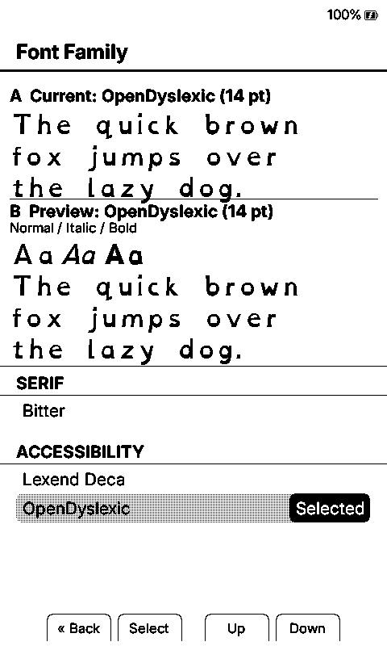
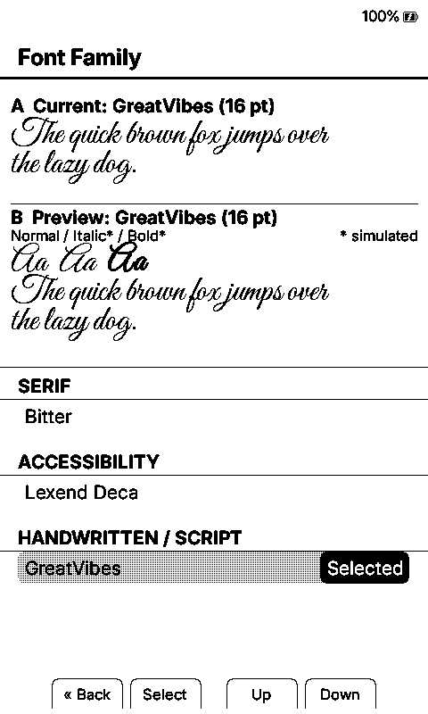

# Fonts

Duet loads `.cpfont` families from the SD card and organizes them as Serif, Sans Serif, Mono/Typewriter, Accessibility, Handwritten/Script, and Blackletter/Decorative. A complete six-size family provides 10, 12, 14, 16, 18, and 20 pt on both X3 and X4.

## Where To Download Fonts Right Now

Choose whichever route fits how many fonts you want:

- **Get the complete Duet collection:** download [`Duet-Open-Font-Pack-v1.zip`](https://github.com/lauren-alexandra/duet-xteink/releases/download/v0.1.0-alpha.7/Duet-Open-Font-Pack-v1.zip). It contains 123 ready-to-copy families, 738 validated `.cpfont` files, all six reader sizes, per-file checksums, upstream source links, and license notices.
- **Install only a few ready-made families:** connect the reader to Wi-Fi and open **Settings > Reader > Font Options > Manage Fonts**. This uses the credited 24-family CrossInk compatibility catalog.
- **Choose individual families from their sources:** open `FONT_PACK_SOURCES.tsv` inside the complete pack or browse [Font Sources](font-sources.md), follow the upstream project link for the family you want, and convert the downloaded TTF/OTF files with Duet's checked-in conversion tool.
- **Use CrossInk's ready-made catalog on a computer:** download compatible `.cpfont` files from the [CrossInk font releases](https://github.com/uxjulia/crossink-fonts/releases), then copy them to `/.fonts/` or `/fonts/`.

You do not need to install the complete pack. The smaller on-device catalog and upstream-source route are there for readers who prefer a short, hand-picked font list.

## Font Preview

Each screenshot compares a different current family with a different preview family.

| Merriweather / Readex Pro | NV Garamond / NV Bitter | Atkinson Hyperlegible Next / OpenDyslexic | Cormorant Garamond / Great Vibes |
| --- | --- | --- | --- |
|  |  |  |  |

## Installing Fonts

There are three ways to install fonts:

### Option 1: Download from device (recommended)

1. Connect your Duet reader to Wi-Fi
2. Go to **Settings > Reader > Font Options > Manage Fonts**
3. Browse available font families and tap to download
4. Downloaded fonts appear immediately in **Settings > Reader > Font Family**

### Option 2: Upload via web browser

1. Start **File Transfer** and connect through **Join Network** or **Create Hotspot**
2. Open the web interface URL shown on the reader
3. Navigate to the **Fonts** tab
4. Upload `.cpfont` files using the upload form

### Option 3: Manual SD card copy

1. Obtain compatible `.cpfont` files from the [complete Duet pack](https://github.com/lauren-alexandra/duet-xteink/releases/download/v0.1.0-alpha.7/Duet-Open-Font-Pack-v1.zip), the on-device catalog, the [CrossInk font releases](https://github.com/uxjulia/crossink-fonts/releases), or your own conversion of an upstream family.
2. Copy font family folders to one of two locations on your SD card:

   - `/.fonts/` — hidden directory (preferred; keeps the SD root tidy when mounted on a desktop)
   - `/fonts/` — visible directory (use this if your OS hides dot-files and you'd rather see the folder in your file manager)

   Both roots are always scanned at boot and the results are merged: a family installed in `/fonts/` shows up even when `/.fonts/` also exists, and vice versa. The two roots only collide if the same family name appears in both — in that case the copy in `/.fonts/` wins and the duplicate in `/fonts/` is ignored.

       SD Card Root/
       ├── .fonts/                     ← Hidden root (preferred)
       │   └── Literata/
       │       ├── Literata_12.cpfont
       │       ├── Literata_14.cpfont
       │       ├── Literata_16.cpfont
       │       └── Literata_18.cpfont
       └── fonts/                      ← Visible root (equally valid)
           └── Merriweather/
               ├── Merriweather_12.cpfont
               └── ...

3. Insert the SD card and power on your Duet reader

## On-Device Font Catalog

The Alpha.7 in-device downloader reads the standard 24-family catalog generated by Duet's checked-in `lib/EpdFont/scripts/sd-fonts.yaml`, using CrossInk's existing compatibility endpoint. The catalog contains:

- **Serif:** Alegreya, Bitter, ChareInk, Gentium Book Plus, IBM Plex Serif, Literata, Lora, Merriweather, Noto Serif Extended, Source Serif 4, Tinos, Domitian, Libre Baskerville, and Vollkorn.
- **Sans Serif:** IBM Plex Sans, Inter, Lexend Deca, Noto Sans Extended, and Source Sans 3.
- **Mono/Typewriter:** IBM Plex Mono and Source Code Pro.
- **Accessibility:** OpenDyslexic, Atkinson Hyperlegible Next, and Lexica Ultralegible.

See [Font Build Variants](font-build-variants.md) for the much smaller emergency fallback set embedded in each firmware BIN. See [Font Sources](font-sources.md) for the open-source projects used by Duet's broader font work.

## Converting Custom Fonts

To convert your own TrueType/OpenType fonts:

### Prerequisites

    pip install freetype-py fonttools

### Single font (one style)

    python3 lib/EpdFont/scripts/fontconvert_sdcard.py \
      MyFont-Regular.ttf \
      --intervals latin-ext \
      --sizes 10,12,14,16,18,20 \
      --style regular \
      --name MyFont \
      --output-dir ./MyFont/

### Multi-style font

    python3 lib/EpdFont/scripts/fontconvert_sdcard.py \
      --regular MyFont-Regular.ttf \
      --bold MyFont-Bold.ttf \
      --italic MyFont-Italic.ttf \
      --bolditalic MyFont-BoldItalic.ttf \
      --intervals latin-ext \
      --sizes 10,12,14,16,18,20 \
      --name MyFont \
      --output-dir ./MyFont/

### Available Unicode interval presets

| Preset | Coverage |
| --- | --- |
| `ascii` | U+0020–U+007E (Basic Latin) |
| `latin1` | U+0080–U+00FF (Latin-1 Supplement) |
| `latin-ext` | European languages (Latin + Extended-A/B + punctuation + ligatures) |
| `greek` | Greek + Extended Greek |
| `cyrillic` | Cyrillic + Supplement |
| `hebrew` | Hebrew + Alphabetic Presentation Forms |
| `georgian` | Georgian + Georgian Supplement |
| `armenian` | Armenian |
| `ethiopic` | Ethiopic + Extended |
| `vietnamese` | Vietnamese subset (ơ/ư and combining marks) |
| `punctuation` | General punctuation (U+2000–U+206F) |
| `cjk` | CJK Unified Ideographs + Hiragana + Katakana + Fullwidth |
| `hangul` | Korean Hangul syllables + Jamo + Compatibility Jamo |
| `cherokee` | Cherokee (historic + supplement block) |
| `tifinagh` | Tifinagh |
| `symbols` | Math, currency, arrows, box-drawing, misc symbols, dingbats |
| `reading` | Literary fiction coverage: Latin, Greek, Cyrillic, math/symbol blocks, supplemental punctuation, and CJK quote marks |
| `builtin` | Matches the firmware's built-in font conversion intervals |

Combine presets with commas: `--intervals latin-ext,greek,cyrillic`

You can also specify arbitrary Unicode ranges directly: `--intervals latin-ext,(0x2100-0x214F)`

To list all presets with codepoint counts:

    python3 lib/EpdFont/scripts/fontconvert_sdcard.py --list-presets

### Additional options

`--force-autohint` — force FreeType's auto-hinter instead of the font's native hinting (useful when a font's built-in hints produce poor results at small sizes).

Install custom fonts via the web interface or manual SD card copy.
